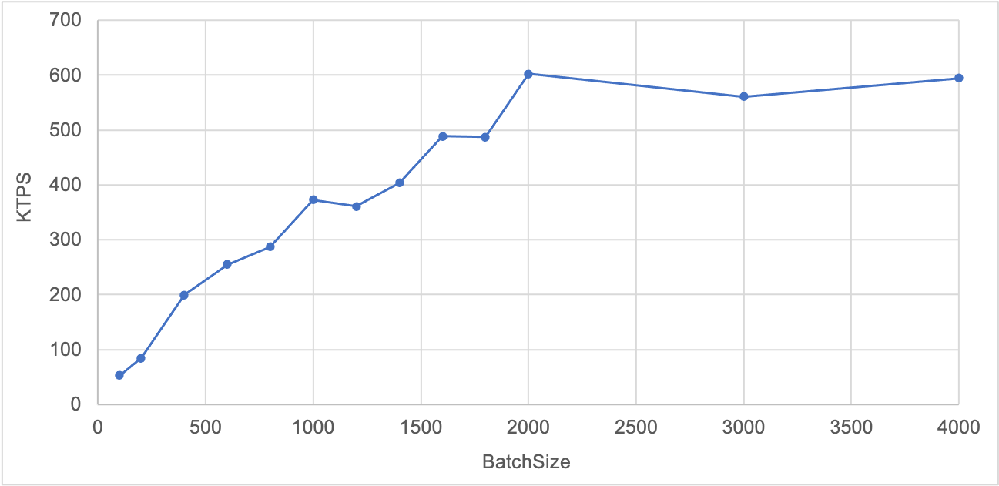

Kafka-Client
===

A quick kakfa client.

## Features

* List existing topics;
* Get the latest offset of a given topic;
* Fill a kafka topic with numbers of messages.

## Installation

### Use Docker (Recommended)

Compile and create a `kafka-client` docker image for quick usage.

```bash
$ make docker
$ docker run --rm -it kafka-client help
```

### Local build

In order to build locally, you need to install `Go 1.12+`, and then run

```bash
$ make mod build
$ ./kafka-client help
```

## Usage

```bash
$ kafka-client help
kafka-client helps you to interact with kafka efficiently, including list topic, get offset or send messages

Usage:
  kafka-client [command]

Available Commands:
  getOffset   Get the last offset in the topic
  help        Help about any command
  listTopics  List the existing topics at the broker
  sendMsg     Send messages to the kafka topic
  version     Print the version number

Flags:
      --config string      config file (default is $HOME/.kafka-client.yaml)
  -h, --help               help for kafka-client
      --kafka-url string   The kafka broker URL to connect with. (default "localhost:9092")
      --log-level string   Specify the logging level from: debug|info|warn|error (default "info")
  -t, --toggle             kafka-client is an efficient client to interact with kafka cluster

Use "kafka-client [command] --help" for more information about a command.
```

### List Topics

```bash
./kafka-client listTopics --help
List the existing topics at the broker

Usage:
  kafka-client listTopics [flags]

Flags:
  -h, --help   help for listTopics

Global Flags:
      --config string      config file (default is $HOME/.kafka-client.yaml)
      --kafka-url string   The kafka broker URL to connect with. (default "localhost:9092")
      --log-level string   Specify the logging level from: debug|info|warn|error (default "info")
```

### Get Offset of a Topic

```bash
./kafka-client getOffset --help
Get the last offset in the topic

Usage:
  kafka-client getOffset [flags]

Flags:
  -h, --help           help for getOffset
      --topic string   The kafka topic to check the offset. (default "test")

Global Flags:
      --config string      config file (default is $HOME/.kafka-client.yaml)
      --kafka-url string   The kafka broker URL to connect with. (default "localhost:9092")
      --log-level string   Specify the logging level from: debug|info|warn|error (default "info")
```

### Send Messages to a Topic

```bash
./kafka-client sendMsg --help
Send given numbers of messages with given batch-size to the kakfa topic

Usage:
  kafka-client sendMsg [flags]

Flags:
      --batch-size int      Size of batch to send. (default 1000)
  -h, --help                help for sendMsg
      --num-msg int         Number of messages to send. Cannot set together with target-offset
      --target-offset int   Send message until the topic reaches the target offset. Cannot set together with num-msg
      --topic string        The kafka topic to send messages to. (default "test")

Global Flags:
      --config string      config file (default is $HOME/.kafka-client.yaml)
      --kafka-url string   The kafka broker URL to connect with. (default "localhost:9092")
      --log-level string   Specify the logging level from: debug|info|warn|error (default "info")
```

## Tutorial

### Setup kafka env

Ignore this step if the kafka env is ready.

Create a kafka cluster with 3 brokers.

```bash
$ git clone github.com/yeasy/docker-compose-files && cd docker-compose-files/kafka
$ make restart
$ make kafka
bash-4.4# bash /tmp/topic_create.sh
Create a topic test by connecting to zookeeper1 with 1 replica and 1 partition
Created topic test.
```

Then start a golang container to connect to the kakfa network, and map this kafka client into it.

```bash
$ git clone github.com/yeasy/kafka-client && cd kafka-client
$ docker run --net kafka_default -it -v $PWD:/go/kafka-client golang:1.14 bash
# cd /go/kafka-client
```

The kakfa-client will be at the `/go/kafka-client` path inside the container.

### List Topics

List the existing topics at the broker.

```bash
$ ./kafka-client listTopics \
        --kafka-url "kafka0:9092"
INFO[0000] GetOffset with params: kafkaURL=kafka0:9092
1 topics: [test]
INFO[0000] Execution time is 52.4489ms
```

### Get Offset of a topic

Get the last offset of a topic.

```bash
$ ./kafka-client getOffset \
        --kafka-url "kafka0:9092" \
        --topic "test"
INFO[0000] GetOffset with params: kafkaURL=kafka0:9092, topic=test
Topic test's offset = 1000000
INFO[0000] Execution time is 36.818ms
```

### Send Numbers of Messages

Send 1000,000 messages to the kakfa topic with hundreds of KTPS.

```bash
$ ./kafka-client sendMsg \
        --kafka-url "kafka0:9092" \
        --topic "test" \
        --num-msg 1000000 \
        --batch-size 1000
INFO[0000] SendMsg with params: kafkaURL=kafka0:9092, topic=test, numMsg=0, batchSize=1000, targetOffset=1000000
INFO[0000] Before sending, the last offset = 0
INFO[0002] After sending 1000000 messages, the last offset = 1000000
INFO[0002] Execution time is 2.7932098s
```

Following figure shows the sending performance with various batch-size.



### Send Messages Until Given Offset

Send messages to the kakfa topic until offset=1000000.

```bash
$ ./kafka-client sendMsg \
        --kafka-url "kafka0:9092" \
        --topic "test" \
        --target-offset 1000000 \
        --batch-size 1000
INFO[0000] SendMsg with params: kafkaURL=kafka0:9092, topic=test, numMsg=0, batchSize=1000, targetOffset=1000000
INFO[0000] Before sending, the offset = 0
INFO[0005] After sending 1000000 messages, the offset = 1000000
INFO[0005] Execution time is 4.9774658s
```

### Create Docker image

```bash
make docker
```

### Test

```bash
make test
```

### Run Linters

```bash
make linter
```
### Update and vendor dependencies

```bash
make mod
```
